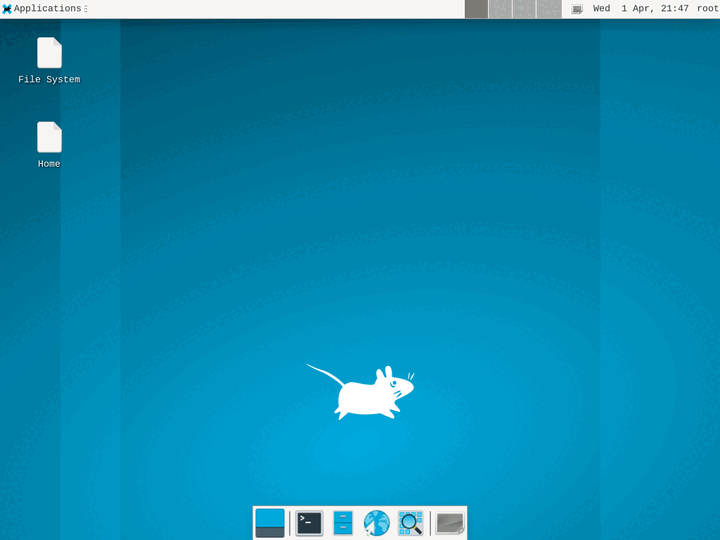

<p align="center">
  <a href="https://omnirun.io">
    <h1 align="center">OmniRun Examples</h1>
  </a>
</p>

<p align="center">
  <strong>Cloud sandboxes for AI agents.</strong><br>
  Each example is a standalone project — clone it, add your API key, and run.
</p>

<p align="center">
  <a href="https://omnirun.io/docs"></a>
  <a href="https://www.npmjs.com/package/@omnirun/sdk"></a>
  <a href="https://pypi.org/project/omnirun/"></a>
  <a href="./LICENSE"></a>
</p>

---

## Examples

### Code Execution

| # | Example | Description |
|---|---------|-------------|
| 01 | [Sandboxed Skill Runner](./01-sandboxed-skill-runner/) | Run untrusted code in isolated Firecracker microVMs |
| 02 | [Build & Preview](./02-build-and-preview/) | AI generates a web app, OmniRun serves it with a shareable preview URL |
| 03 | [AI Code Review](./03-ai-code-review/) | Clone a repo, install deps, run tests — all in an isolated VM |
| 04 | [Daily Briefing](./04-daily-briefing/) | Parallel data collection from multiple sources, each in its own sandbox |
| 05 | [Code Execution API](./05-code-execution-api/) | HTTP API that runs user code in sandboxes (like a mini Replit) |

### Infrastructure

| # | Example | Description |
|---|---------|-------------|
| 06 | [LLM Proxy](./06-llm-proxy/) | Access language models through OmniRun's proxy with spend tracking |
| 07 | [Vault Injection](./07-vault-injection/) | Store secrets in the vault and inject them into sandboxes as env vars |

### Desktop Automation

| # | Example | Description | Demo |
|---|---------|-------------|------|
| 08 | [Desktop Web Browsing](./08-desktop-web-browsing/) | Launch a desktop sandbox, browse websites, capture screenshots |  |
| 09 | [Desktop App Automation](./09-desktop-app-automation/) | Automate terminal and file manager through keyboard/mouse control |  |
| 10 | [Visual Regression Testing](./10-desktop-visual-testing/) | Visual regression testing with real browser screenshots — no Playwright needed |  |
| 11 | [Desktop AI Agent](./11-desktop-ai-agent/) | Autonomous AI agent that controls a Linux desktop using screenshots and LLM vision |  |

## Quick Start

**1. Install the SDK**

```bash
npm install @omnirun/sdk
```

**2. Set your API key**

```bash
export OMNIRUN_API_KEY=your-key-here
# Get a free key at https://omnirun.io/docs
```

**3. Run an example**

```bash
cd 01-sandboxed-skill-runner
cp .env.example .env       # add your API key
npm install
npm start
```

## Why OmniRun?

OmniRun gives each execution its own [Firecracker](https://firecracker-microvm.github.io/) microVM — a real virtual machine with its own kernel, filesystem, and network namespace. Not a container, not a process sandbox — a VM that boots in under a second.

| | Host execution | Docker | OmniRun |
|---|---|---|---|
| Kernel isolation | No | No (shared kernel) | Yes (Firecracker) |
| Filesystem isolation | No | Partial (namespace) | Full (own rootfs) |
| Network isolation | No | Partial (bridge) | Full (own netns) |
| Boot time | 0ms | ~500ms | ~840ms |
| Escape CVEs (2024-2026) | N/A | 12+ | 0 |

## SDKs and Tools

| Package | Install |
|---------|---------|
| [TypeScript SDK](https://github.com/a14a-org/omnirun-sdk) | `npm install @omnirun/sdk` |
| [Python SDK](https://github.com/a14a-org/omnirun-sdk-python) | `pip install omnirun` |
| [CLI](https://www.npmjs.com/package/@omnirun/cli) | `npm install -g @omnirun/cli` |

## Prerequisites

- Node.js 18+
- An OmniRun API key ([get one free](https://omnirun.io/docs))
- `@omnirun/sdk` (installed per-example via npm)

## Contributing

Contributions are welcome! To add an example:

1. Create a new numbered directory (e.g. `12-your-example/`)
2. Include a `README.md` explaining what it demonstrates
3. Add a `.env.example` with required environment variables
4. Keep it self-contained — `npm install && npm start` should work
5. Open a PR

## Learn More

- [OmniRun Docs](https://omnirun.io/docs)
- [OmniRun Tutorials](https://omnirun.io/tutorials)
- [SDK Reference](https://www.npmjs.com/package/@omnirun/sdk)
- [CLI Reference](https://www.npmjs.com/package/@omnirun/cli)

## License

MIT
